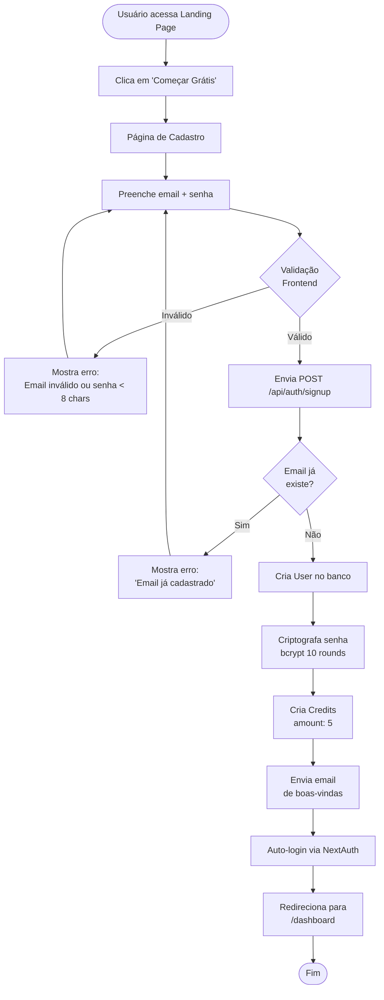
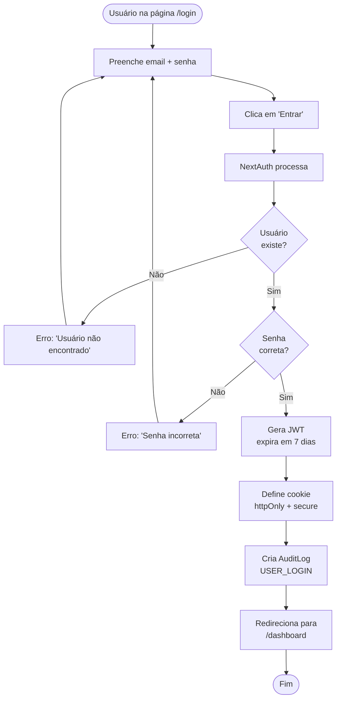
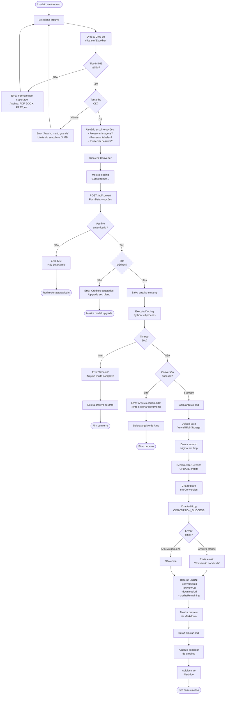
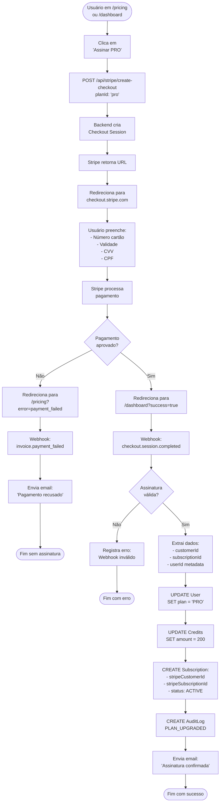
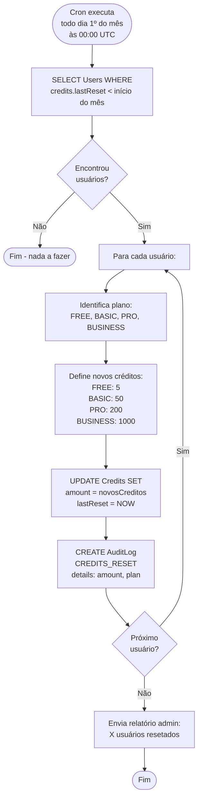
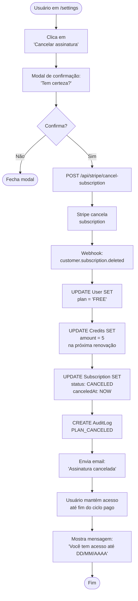
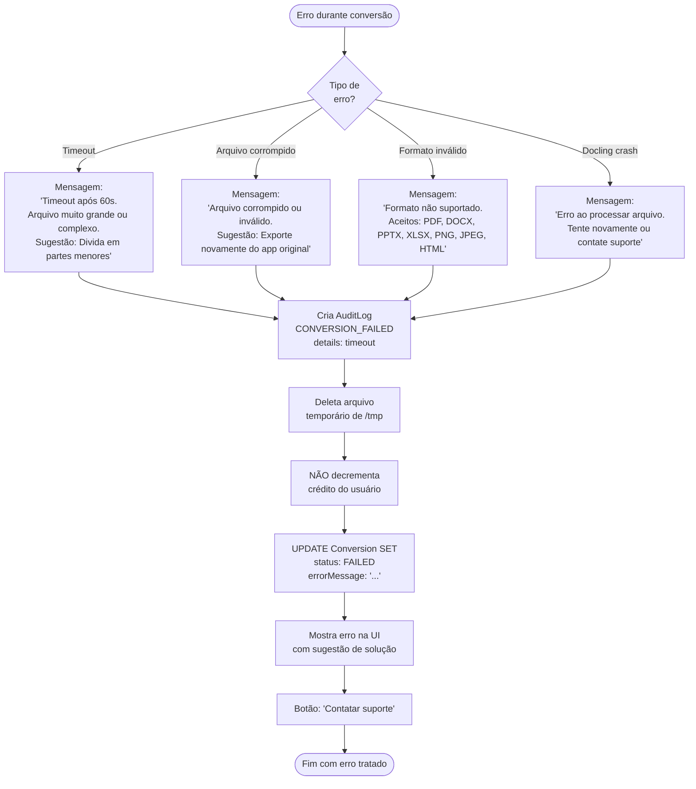
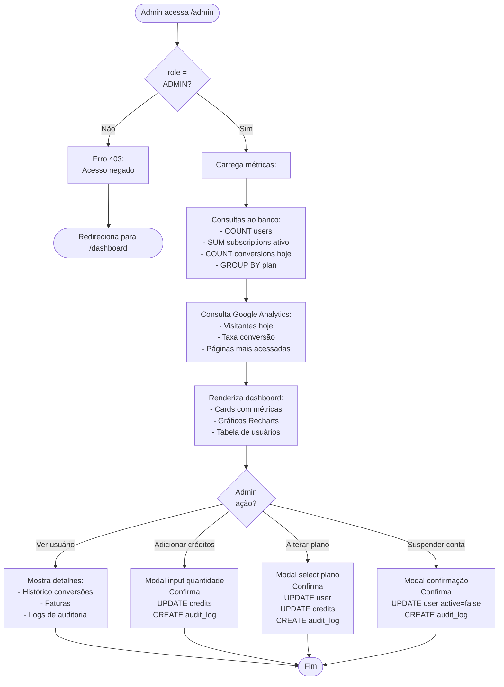
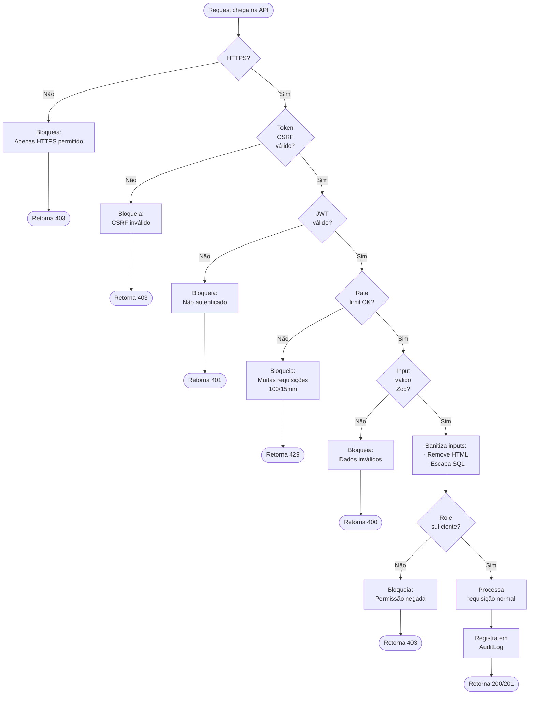

# CrescitechMD - Fluxogramas de Processos

**Versão:** 1.0  
**Data:** 01/03/2026

---

## 1. Fluxo de Cadastro e Primeiro Acesso



---

## 2. Fluxo de Login



---

## 3. Fluxo Completo de Conversão de Arquivo



---

## 4. Fluxo de Assinatura Stripe



---

## 5. Fluxo de Reset Mensal de Créditos (Cron Job)



---

## 6. Fluxo de Sistema de Referência

```mermaid
flowchart TD
    Start([Usuário acessa<br/>/referral]) --> ShowCode[Mostra código único:<br/>ex: 'A3K9M2X7']
    
    ShowCode --> CopyLink[Usuário copia link:<br/>crescitechmd.com/signup?ref=A3K9M2X7]
    CopyLink --> ShareLink[Compartilha com amigo]
    
    ShareLink --> FriendClick[Amigo clica no link]
    FriendClick --> SignupPage[Página /signup<br/>com ref no URL]
    
    SignupPage --> FriendSignup[Amigo se cadastra]
    FriendSignup --> CreateUser[Cria User normal]
    CreateUser --> CreateReferral[CREATE Referral:<br/>- referrerId<br/>- referredId<br/>- referralCode<br/>- status: PENDING]
    
    CreateReferral --> GiveBonus1[Adiciona +5 créditos<br/>ao amigo (bônus cadastro)]
    GiveBonus1 --> End1([Amigo recebe bônus])
    
    End1 --> WaitPayment[Aguarda amigo<br/>fazer primeiro pagamento]
    WaitPayment --> FriendPays[Amigo assina<br/>plano pago]
    
    FriendPays --> WebhookPay[Webhook Stripe<br/>checkout.session.completed]
    WebhookPay --> CheckReferral{Tem<br/>referência<br/>PENDING?}
    
    CheckReferral -->|Não| End2([Fim normal])
    
    CheckReferral -->|Sim| UpdateStatus[UPDATE Referral SET<br/>status: CONVERTED<br/>creditsAwarded: 10]
    
    UpdateStatus --> AddCreditsRef[Adiciona +10 créditos<br/>ao referenciador]
    AddCreditsRef --> CreateLog[CREATE AuditLog<br/>REFERRAL_CONVERTED]
    CreateLog --> SendEmailRef[Envia email ao referenciador:<br/>'Você ganhou 10 créditos!']
    
    SendEmailRef --> End3([Fim com recompensa])
```

---

## 7. Fluxo de Cancelamento de Assinatura



---

## 8. Fluxo de Tratamento de Erros de Conversão



---

## 9. Fluxo de Dashboard Administrativo



---

## 10. Fluxo de Validação e Segurança



---

**Última atualização:** 01/03/2026
